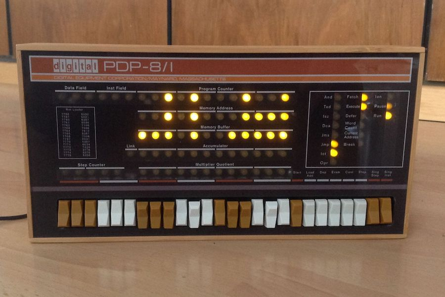
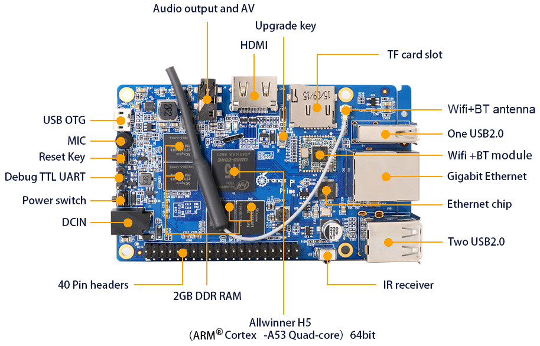

# Raspberry PI


---

## Overview

- What is a Raspberry PI
- How I'm using it
- Alternatives

---

## What is a Raspberry PI


- Fully functioning computer on a single board
- ARM based processor. Examples of where ARM processors are used
  - Apple iPods and iPhones... All of them.
  - Apple's new Silicon processor is ARM based
  - Android phones
- As of December 2019, more than thirty million boards have been sold [twitter](https://twitter.com/EbenUpton/status/1205646606504275968).

Note:

- ARM: Advanced RISC Machines
- RISC: Reduced instruction set computer


## Recent news

### Raspberry Pi Pico


Note:

- First announced on 23rd so haven't looked in to it much


## Raspberry Pi pico info

- "microcontroller class"
- program in C or MicroPython
- actual product is RP2040 chip on board
- partnered with several vendors to create their own accessories
  - Adafruit
  - Arduino
  - Pimoroni
  - SparkFun

---

## How I am using them

---

## GPS NTP Server

- GPS needs to have very accurate time
- Can tap in to that to get a very precise time
- GPS module emits a PPS (Pulse Per Second) signal "Exactly" on the second
- Typical accuracy using a network source is within 500&micro;s
- Typical accuracy using gps is 1&micro;s

Note:

- PPS: Pulse Per Second


## GPS Setup: The Pi Itself


- Raspberry Pi 1 Model B
- GPS module: Adafruit Ultimate GPS Breakout v3

Note:

- Required a custom compiled NTPD server in order to access the PPS signal
  - did this from virtualbox on desktop as it could take up to an hour to compile on pi itself
  - Don't have exact times but was only a couple minutes if that on desktop


## GPS Setup: The antenna


- Only has to be "line of sight-ish" to the sky
- Magnet sticks to metal corner bead in wall


<!-- .slide: data-transition="slide-in fade-out" -->
## Example: network

```plain
$ ntpq -pn
     remote           refid      st t when poll reach   delay   offset  jitter
==============================================================================
*209.221.30.16   129.6.15.28      2 u   56  128  377    7.559    1.330   2.778
+216.230.105.211 129.6.15.29      2 u   73  128  377   14.504    1.291   1.127
-66.11.0.18      209.221.30.16    3 u   32  128  377    9.131    1.859   0.141
+209.166.170.250 128.59.0.245     2 u   20  128  377   21.017   -0.267   3.797
```

<small>delay, offset, and jitter are reported in milliseconds so 1.042 is 1.042ms or .001042 seconds.</small>


<!-- .slide: data-transition="fade-in slide-out" -->
## Example: GPS

```plain
$ ntpq -pn
     remote           refid      st t when poll reach   delay   offset  jitter
==============================================================================
o127.127.20.0    .GPS.            0 l    2   16  377    0.000   -0.001   0.002
*198.74.51.125   216.218.192.202  2 u 1028 1024  377   76.109    5.691   0.601
+162.159.200.1   10.14.12.181     3 u  823 1024  377   28.231    1.760   1.766
+44.190.6.254    184.105.182.7    3 u   26 1024  377   74.413   -6.498   2.389
```

<small>delay, offset, and jitter are reported in milliseconds so 1.042 is 1.042ms or .001042 seconds.</small>


## GPS accuracy

<div class="r-stack">


</div>

---

## Tracking air traffic

- Radar can't give information like the flight ID
- Aircraft use ADS-B transmitters to fill the gap
  - Broadcast at 1090MHz in the clear
  - Means anyone can receive this information with a proper receiver
  - Even a basic setup can see air traffic over 100 nautical miles away
- Several sites such as flightaware.com encourages public receivers

Note:

- ADS-B: Automatic Dependent Surveillance-Broadcast
- Nautical Mile: 1852 metres (6076 ft; 1.151 mi)


## ADS-B receiver setup


- Hardware: Raspberry Pi 3 Model B
- Antenna: Small antenna stuck to frame of window
- SDR: FlightAware Pro Stick Plus

Note:

- SDR: software defined radio

---

## OctoPrint

- Web interface to 3D printer
- Add a touch screen to raspberry pi to control it
- Supports Raspberry Pi camera for remote monitoring
- Prebuilt image to download and copy to microsd card


## OctoPrint setup


<br>

- Hardware: Raspberry Pi 3 Model B+
- Display: Adafruit PiTFT Plus 3.5"
- Display program: OctoScreen

Note:

- Printer: Geeetech Prusa I3


## Challenges and suggestions

- Display was hard to get working because of rotation and resizing the viewport
- The USB connected to printer can backfeed power to pi even when turned off
- Likewise, printer will use power supplied by Pi to show display on printer
  - Look for a USB cable adapter with a switch
  - Make sure it supports data as some only control power
  - Keep turned off if don't have both running

---

## PiDP8



https://obsolescence.wixsite.com/obsolescence/pidp-8

---

## Other projects


## Pi-hole

- https://pi-hole.net/
- blocks ads for entire network using DNS filtering


## Home assistant

- https://www.home-assistant.io/
- links most of your various internet connected things together
- mostly free but offer a premium service for integrations like with Amazon Echo
- remember if this then that?  Functions very similar.
- I run it in a docker image but official install is via raspberry pi

Note:

- Amazon Echo integration requires that your server be available on the internet via https and with a valid certificate.  Doable but can be a lot of work
- ifttt.com is still around but severely limited the free offering without grandfathering in existing users.  Little chaffed on that.


## OpenVPN server

- https://github.com/angristan/openvpn-install
- Download and run script and will setup a raspberry pi as a vpn server
- also a wireguard-install project to use wireguard for a vpn


## Steam link app for Raspberry Pi

- https://support.steampowered.com/kb_article.php?ref=6153-IFGH-6589
- acts as a thin client to your main desktop on local network
- remote desktop but optimized for games
- originally sold as custom hardware
- Works with 3B and 3B+ (doesn't mention 4 series)

---

## Buying suggestions


## Beginner

- Go with Raspberry Pi 3 Model B+
  - have heard of people having "issues" with the v4 models but not sure what
- have had good experience with CanaKit packs on amazon
  - usually just get the board, heat sink, and power adapter
  - other things I either have already or buy separately like MicroSD cards


## More interested in electronics

- Adaruit has several starter kits and include leds and breadboard and such
- CanaKit also offers a pretty big hobby kit.

---

## Alternatives


## Odroid XU4


- https://ameridroid.com/products/odroid-xu4
- higher performance, USB 3 ports, Octa core CPU


## Banana Pi


- http://www.banana-pi.org/m3.html
- offer several different versions
- M3 is older but seems to be the most recommended of batch


## Orange Pi



- http://www.orangepi.org/OrangePiPrime/
- also offer several different versions (Prime shown above)

---

## What I learned

- lower level programming <!-- .element: class="fragment" -->
- wireless technology <!-- .element: class="fragment" -->

Note:

- lower level programming
    - came from PHP, python
    - how to take two bytes and convert to integer
- wireless
    - can save 8 bytes by converting float (4 bytes) to int (2 bytes)
    - dealing with interference

## Is the garage door fixed?

- never could figure out why it would open
- since using this there was maybe one time door opened on it's own
- Improved monitoring of garage...


## A new way to check garage door

<p></p>

Note:

- if just left and unsure can look it up on phone (after pulling in to a parking lot of course)

<p>CHECK TIME BEFORE GOING DOWN TO NEXT SLIDE<p>


## Other arduino projects

---

## Questions?

- https://jeelabs.net/projects/hardware/wiki/JeeNode - Information on jeenodes
    - Search for: `jeenode`
- https://moderndevice.com/product/jeenode-v6-kit/ - Where to buy it
    - Search for: `jeenode modern device`
- Code for jeelinks
    - https://github.com/vrillusions/jeenode-sketches
- Code for jeelink-listener that receives info from jeenodes:
    - https://github.com/vrillusions/jeelink-receiver
